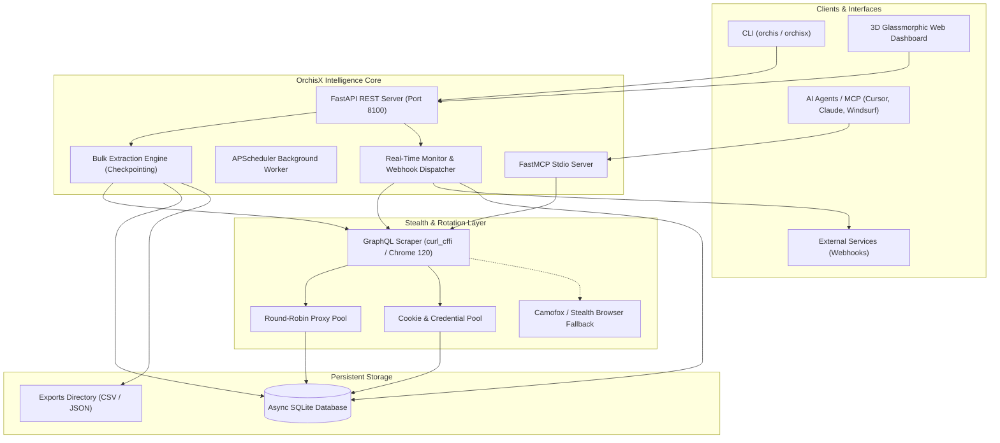

<p align="center">
  
</p>

<p align="center">
  <strong>High-Performance Self-Hosted Twitter & Web Scraping Intelligence Platform</strong>
</p>

<p align="center">
  <a href="#features"></a>
  <a href="#rest-api"></a>
  <a href="#model-context-protocol-fastmcp"></a>
  <a href="#core-architecture"></a>
  <a href="#license"></a>
</p>

---

## 🌐 Overview

**OrchisX Engine** is an enterprise-grade, self-hosted data extraction and OSINT intelligence suite engineered for Twitter (X) and web intelligence. Powered by high-speed TLS fingerprint impersonation (`curl_cffi` / `Chrome 120`), smart adaptive rate-limit cooldown schedulers, multi-account rotation, dynamic proxy pools, and headless Camofox anti-bot stealth fallback, OrchisX enables seamless real-time search, bulk historical extractions (50,000+ items), 24/7 automated monitoring, and native AI Agent (MCP) tooling.

Featuring a **Glassmorphic 3D Web Dashboard** with real-time particle background, multi-language internationalization (English, Turkish, Spanish, German, French), light/dark theming, a unified CLI (`orchis`), and a standard **Model Context Protocol (MCP)** server for seamless integration with Cursor, Claude Code, Windsurf, and LLM autonomous workflows.

---

## ✨ Key Features

| Capability | Description |
| :--- | :--- |
| ⚡ **GraphQL & Stealth Scraper** | Direct Twitter GraphQL protocol extraction with TLS fingerprint spoofing (`impersonate="chrome120"`), bypassing anti-bot challenges without official API keys. |
| 🔄 **Bulk Extraction Engine** | High-throughput asynchronous batch collector supporting pagination across 50,000+ items with automatic checkpoint recovery and CSV/JSON exports. |
| ⏳ **Smart Rate-Limit Auto-Resume** | Automatic 15-minute cooldown scheduler upon hitting HTTP 429 rate limits, live UI countdown timer, and automatic execution resume without data loss. |
| 🛡️ **Proxy & Account Pool** | Multi-proxy rotation (HTTP/SOCKS5) with automated latency/health benchmarks and multi-cookie account pool with load-balanced rotation. |
| 📡 **24/7 Keyword & Timeline Monitors** | Background scheduling daemon that tracks search queries and user timelines periodically, firing HMAC-SHA256 authenticated webhooks on new matches. |
| 🤖 **FastMCP Server Integration** | Built-in stdio Model Context Protocol server exposing 7 structured intelligence tools (`orchis_*`) directly to LLMs and AI coding assistants. |
| 💻 **Unified CLI Tool (`orchis`)** | Complete command-line management for search, profile lookups, bulk extractions, proxy benchmarks, and background daemons. |
| 🎨 **Interactive 3D Web Dashboard** | Modern responsive glassmorphism interface featuring 3D Vanta.js NET particles, light/dark mode persistence, and 5-language i18n dictionary. |

---

## 🏛️ System Architecture



---

## 🚀 Quick Start

### 1. Prerequisites

- **Python 3.10+** (Tested on Python 3.10, 3.11, 3.12, 3.14)
- **Node.js 18+** (Optional, for Camofox browser fallback)

### 2. Installation

Clone the repository and install dependencies inside a virtual environment:

```bash
# Clone the repository
git clone https://github.com/thecoldblooded/OrchisX.git
cd OrchisX

# Create and activate virtual environment
python3 -m venv .venv
source .venv/bin/activate

# Install OrchisX in editable mode with development dependencies
pip install -e .
```

### 3. Environment Configuration

Copy the example environment configuration:

```bash
cp .env.example .env
```

Edit `.env` to configure your custom settings, ports, and master API key.

---

## 💻 CLI Usage (`orchis`)

OrchisX includes a full-featured CLI accessible via `orchis` or `orchisx`:

### 🔍 Live Search

```bash
# Search tweets with keyword
orchis search "artificial intelligence" --limit 50

# Advanced search with engagement filters
orchis search "AI agents min_faves:100 lang:en" --limit 20
```

### 👤 User Profile & Timeline

```bash
# Inspect a user profile
orchis user profile elonmusk

# Fetch user's latest tweets
orchis user tweets elonmusk --limit 30
```

### 📦 Bulk Data Extractions

```bash
# Extract 1,000 tweets matching query to CSV
orchis extract start search "cybersecurity" --limit 1000 --format csv

# Extract user followers to JSON
orchis extract start followers openai --limit 500 --format json

# List active extraction jobs
orchis extract list
```

### 🛡️ Account & Proxy Management

```bash
# Add a Twitter cookie account (auth_token & ct0)
orchis account add --username "analyst_01" --auth-token "YOUR_AUTH_TOKEN" --ct0 "YOUR_CT0"

# Import proxies from text file
orchis proxy import ./proxies.txt

# Benchmark proxy latency and health
orchis proxy test
```

### 🖥️ Launch Web Server & Dashboard

```bash
# Start FastAPI server on http://0.0.0.0:8100 with auto-reload
orchis server --host 0.0.0.0 --port 8100 --reload
```

---

## 🌐 Web Dashboard & Internationalization
Access the interactive dashboard at **`http://localhost:8100/`**.
<p align="center">
  
</p>

### Features:
- 🎨 **Glassmorphic Dark & Light Modes:** Synchronous pre-render script to eliminate theme flashing, with custom SVG transparent background watermarks.
- 🌐 **Full 5-Language i18n Dictionary:** Seamless dynamic switching between **English (EN)**, **Turkish (TR)**, **Spanish (ES)**, **German (DE)**, and **French (FR)**.
- 📊 **Real-time Job Progress & Control:** Live countdown timer on rate-limited cooldowns (`auto_resume_at`), with Pause, Resume, Cancel, and Retry controls.
- ⚡ **Interactive 3D Vanta NET Canvas:** GPU-accelerated interactive particle background.

---

## 🤖 Model Context Protocol (FastMCP)

OrchisX provides a built-in **Model Context Protocol (MCP)** server, enabling LLMs in Cursor, Claude Code, Windsurf, or OpenCode to scrape Twitter data autonomously.

### Available MCP Tools:
1. `orchis_search_tweets(query, limit, cursor)`: Real-time search with engagement filters.
2. `orchis_get_user_profile(username)`: Detailed follower/following metrics and bio.
3. `orchis_get_user_tweets(username, limit, cursor)`: Fetch user timeline.
4. `orchis_start_extraction(query, extraction_type, limit, export_format)`: Trigger background bulk extraction.
5. `orchis_get_extraction_status(job_id)`: Check extraction progress and download link.
6. `orchis_add_proxy(url)`: Register a proxy into the active pool.
7. `orchis_create_monitor(name, query, monitor_type, interval_minutes, webhook_url)`: Setup automated 24/7 monitor.

### Claude Desktop / Cursor Configuration:

Add to your `claude_desktop_config.json` or `~/.cursor/mcp.json`:

```json
{
  "mcpServers": {
    "orchisx": {
      "command": "/Users/your-user/Projects/OrchisX/.venv/bin/orchis",
      "args": ["mcp"]
    }
  }
}
```

---

## 📡 REST API Reference
The FastAPI service exposes interactive Swagger/OpenAPI documentation at **`http://localhost:8100/docs`**:
| Method | Endpoint | Description |
| :--- | :--- | :--- |
| `GET` | `/health` | Server health check and database status |
| `POST` | `/api/tweets/search` | Search tweets with engagement filters |
| `GET` | `/api/users/{username}` | Get user profile metadata and metrics |
| `GET` | `/api/users/{username}/tweets` | Get user timeline tweets |
| `POST` | `/api/extractions` | Create asynchronous bulk extraction job |
| `GET` | `/api/extractions` | List extraction jobs with progress and status |
| `POST` | `/api/extractions/{id}/pause` | Pause an active extraction job |
| `POST` | `/api/extractions/{id}/resume` | Resume a paused or rate-limited extraction |
| `POST` | `/api/extractions/{id}/cancel` | Cancel an extraction job |
| `GET` | `/api/extractions/{id}/download` | Download exported CSV / JSON dataset |
| `GET` | `/api/pool/proxies` | List proxies with health and latency scores |
| `POST` | `/api/pool/accounts` | Add account credentials to cookie pool |
| `POST` | `/api/monitors` | Create a 24/7 periodic monitor with webhook |

---

## 🧪 Testing & Verification

Run the comprehensive automated test suite with `pytest`:

```bash
# Run all unit and integration tests
pytest tests/ -v
```

```
============================== 20 passed in 3.51s ==============================
```

---

## 🔒 Security & Privacy Notice

- **Self-Hosted & Local First:** All extracted data, proxy lists, and credentials remain locally in your local SQLite database (`x_scraper.db`) and are never sent to third parties.
- **Zero Hardcoded Secrets:** Credentials and API keys are loaded via environment variables (`.env`).
- **Webhook Integrity:** All webhook dispatches include an `X-Orchis-Signature` HMAC-SHA256 header for payload verification.

## 📄 License

This project is licensed under the MIT License - see the [LICENSE](LICENSE) file for details.

<p align="center">
  <sub>Built with ❤️ by Orchis Intelligence Team</sub>
</p>
